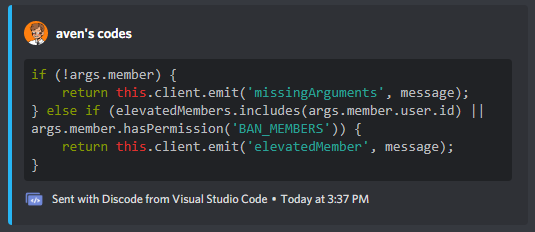

# Discode

A Visual Studio Code extension that allows you to share code to Discord with webhooks.

*[Make sure to join the official Discode Discord server here!](https://discord.gg/Cm3ADqfPpp)*

## Usage

After installing the extension, open up the Command Palette and under "Discode" use the "Set a Webhook" command.
This command can also be used to update an existing webhook, and while you can configure it in the settings it is generally recommended to do so with the command.

After you're done setting up, all it takes is to select text, right click and press "Share Code to Discord"!

*You can also use the same command through the Command Palette.*

## Extension Settings

This extension contributes the following settings:

* `discode.webhook`: The webhook the extension uses to share the code to.
* `discode.name`: The name that gets set as the embed's author.
* `discode.avatar`: The image that gets set as the embed's author's avatar.

## Known Issues

* None so far! If you encounter any issues please file an issue in the GitHub repository.

## Release Notes

### Release 1.1.0

* "Set a Webhook" command's input boxes don't disappear now if window focus is lost.
* Code longer than 1024 characters is now sent through a Hastebin link.
* Unnecessary whitespace is now removed from selection.
* The embed's footer now has Discode's logo.
* Grammatical fixes.

### Release 1.0.0

* Initial release of Discode.
